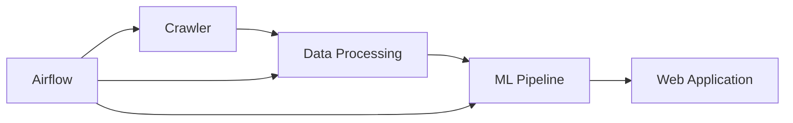

# Dự án Phân Tích Bất Động Sản

## Tổng Quan

Dự án này là một hệ thống phân tích và dự đoán thị trường bất động sản, bao gồm các thành phần chính sau:

1. **Crawler**: Thu thập dữ liệu từ các nguồn bất động sản
2. **Data Processing**: Xử lý và chuẩn bị dữ liệu
3. **ML Pipeline**: Huấn luyện và triển khai các mô hình dự đoán
4. **Web Application**: Giao diện người dùng và API

## Cấu Trúc Dự Án

```
real_estate_project/
├── crawler/                 # Module thu thập dữ liệu
├── data_processing/        # Module xử lý dữ liệu
│   ├── spark/             # Xử lý dữ liệu với Spark
│   ├── airflow/           # Quản lý luồng dữ liệu
│   └── ml/                # Mô hình machine learning
├── webapp/                # Ứng dụng web
│   ├── client/           # Frontend
│   └── server/           # Backend API
└── docker/               # Cấu hình Docker
```

## Luồng Dữ Liệu



## Tài Liệu Chi Tiết

-   [Crawler Documentation](crawler/README.md)
-   [Data Processing Documentation](data_processing/README.md)
-   [ML Pipeline Documentation](data_processing/ml/README.md)
-   [Web Application Documentation](webapp/README.md)
-   [Airflow Documentation](data_processing/airflow/README.md)

## Cài Đặt và Chạy

1. Cài đặt Docker và Docker Compose
2. Clone repository
3. Chạy lệnh:

```bash
docker-compose up -d
```

## Yêu Cầu Hệ Thống

-   Docker Engine 20.10+
-   Docker Compose 2.0+
-   RAM: Tối thiểu 8GB
-   CPU: Tối thiểu 4 cores
-   Disk: Tối thiểu 20GB

## Liên Hệ

[Thông tin liên hệ của bạn]
