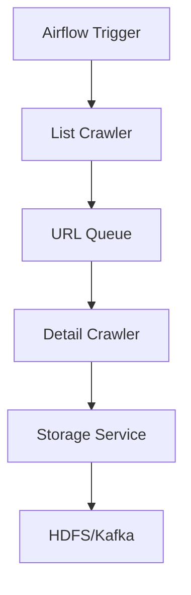

# Module Crawler

## Tổng Quan

Module Crawler chịu trách nhiệm thu thập dữ liệu bất động sản từ các nguồn khác nhau như Batdongsan, Chotot, v.v.

## Cấu Trúc Module

```
crawler/
├── common/                 # Các thành phần dùng chung
│   ├── base/              # Các lớp cơ sở
│   ├── factory/           # Factory patterns
│   ├── storage/           # Xử lý lưu trữ
│   └── models/            # Các model dữ liệu
├── services/              # Các service xử lý
│   ├── list_crawler/      # Crawl danh sách
│   ├── detail_crawler/    # Crawl chi tiết
│   └── storage_service/   # Quản lý lưu trữ
└── sources/               # Các nguồn dữ liệu
    ├── batdongsan/        # Crawler Batdongsan
    └── chotot/            # Crawler Chotot
```

## Luồng Xử Lý



## Các Crawler Hiện Có

1. **Batdongsan Crawler**

    - Crawl danh sách từ trang chủ
    - Crawl chi tiết từ URL
    - Xử lý phân trang

2. **Chotot Crawler**
    - Sử dụng API
    - Crawl theo khu vực
    - Xử lý rate limiting

## Cấu Hình

```yaml
crawler:
    batch_size: 100
    retry_attempts: 3
    delay_between_requests: 2
    storage:
        type: hdfs
        path: /data/raw
```

## Chạy Crawler

```bash
# Chạy crawler Batdongsan
python -m crawler.services.list_crawler --source batdongsan

# Chạy crawler Chotot
python -m crawler.services.list_crawler --source chotot
```

## Giám Sát

-   Số lượng URL đã crawl
-   Tỷ lệ thành công/thất bại
-   Thời gian xử lý
-   Dung lượng dữ liệu

## Xử Lý Lỗi

-   Retry mechanism
-   Error logging
-   Alert system
-   Checkpointing

## Tích Hợp

-   Airflow DAGs
-   Kafka topics
-   HDFS storage
-   Monitoring system
