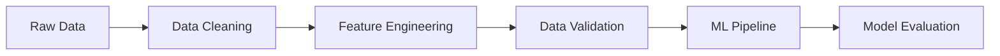

# Module Xử Lý Dữ Liệu

## Tổng Quan

Module Data Processing chịu trách nhiệm xử lý và chuẩn bị dữ liệu bất động sản cho việc phân tích và huấn luyện mô hình.

## Cấu Trúc Module

```
data_processing/
├── spark/                 # Xử lý dữ liệu với Spark
│   ├── jobs/             # Các job xử lý
│   └── utils/            # Tiện ích
├── airflow/              # Quản lý luồng dữ liệu
│   └── dags/             # Các DAG
├── notebooks/            # Jupyter notebooks
└── ml/                   # Machine Learning
    ├── models/           # Các mô hình
    ├── features/         # Xử lý đặc trưng
    └── evaluation/       # Đánh giá mô hình
```

## Luồng Xử Lý Dữ Liệu



## Các Bước Xử Lý

1. **Data Cleaning**

    - Xử lý missing values
    - Chuẩn hóa dữ liệu
    - Loại bỏ outliers

2. **Feature Engineering**

    - Tạo đặc trưng mới
    - Chuyển đổi dữ liệu
    - Chuẩn hóa đặc trưng

3. **Data Validation**
    - Kiểm tra tính nhất quán
    - Xác thực dữ liệu
    - Báo cáo chất lượng

## Spark Jobs

```bash
# Chạy job làm sạch dữ liệu
spark-submit jobs/data_cleaning.py

# Chạy job xử lý đặc trưng
spark-submit jobs/feature_engineering.py
```

## Airflow DAGs

1. **data_processing_dag**

    - Làm sạch dữ liệu
    - Xử lý đặc trưng
    - Kiểm tra chất lượng

2. **ml_pipeline_dag**
    - Huấn luyện mô hình
    - Đánh giá mô hình
    - Triển khai mô hình

## Notebooks

-   `data_exploration.ipynb`: Phân tích dữ liệu
-   `feature_engineering.ipynb`: Thử nghiệm đặc trưng
-   `model_experiments.ipynb`: Thử nghiệm mô hình

## Giám Sát

-   Chất lượng dữ liệu
-   Hiệu suất xử lý
-   Tài nguyên sử dụng
-   Lỗi và cảnh báo

## Tích Hợp

-   HDFS storage
-   Kafka streams
-   MLflow tracking
-   Model registry
