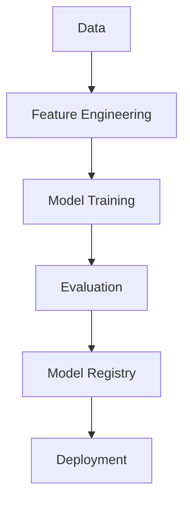

# Module Machine Learning

## Tổng Quan

Module Machine Learning chịu trách nhiệm huấn luyện, đánh giá và triển khai các mô hình dự đoán giá bất động sản.

## Cấu Trúc Module

```
ml/
├── models/                # Các mô hình
│   ├── price/            # Dự đoán giá
│   ├── classification/   # Phân loại
│   └── clustering/       # Phân cụm
├── features/             # Xử lý đặc trưng
│   ├── extraction/       # Trích xuất đặc trưng
│   └── selection/        # Lựa chọn đặc trưng
└── evaluation/           # Đánh giá mô hình
    ├── metrics/          # Các metric
    └── reports/          # Báo cáo
```

## Luồng Huấn Luyện



## Các Mô Hình

1. **Price Prediction**

    - Linear Regression
    - Random Forest
    - XGBoost
    - Neural Network

2. **Property Classification**

    - Property Type
    - Price Range
    - Location Quality

3. **Market Analysis**
    - Price Trend
    - Market Segmentation
    - Investment Potential

## Feature Engineering

1. **Numerical Features**

    - Area
    - Price per square meter
    - Distance to landmarks
    - Age of property

2. **Categorical Features**

    - Location
    - Property type
    - Amenities
    - Legal status

3. **Text Features**
    - Description analysis
    - Title analysis
    - Sentiment analysis

## Đánh Giá Mô Hình

1. **Metrics**

    - RMSE
    - MAE
    - R²
    - Cross-validation scores

2. **Validation**
    - Train/Test split
    - Time-based validation
    - Cross-validation
    - Hold-out validation

## Triển Khai

1. **Model Registry**

    - Version control
    - Model metadata
    - Performance tracking

2. **API Endpoints**
    - Prediction service
    - Batch processing
    - Real-time inference

## Giám Sát

-   Model performance
-   Data drift
-   Prediction quality
-   System metrics

## Tích Hợp

-   MLflow
-   TensorFlow Serving
-   FastAPI
-   Prometheus
