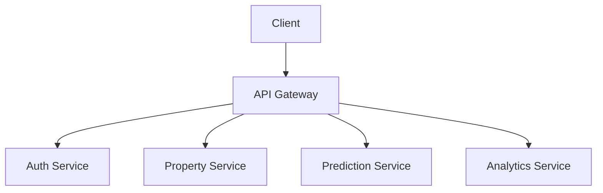

# Module Web Application

## Tổng Quan

Module Web Application cung cấp giao diện người dùng và API để tương tác với hệ thống phân tích bất động sản.

## Cấu Trúc Module

```
webapp/
├── client/                # Frontend
│   ├── src/              # Source code
│   ├── public/           # Static files
│   └── tests/            # Unit tests
└── server/               # Backend
    ├── api/              # API endpoints
    ├── models/           # Data models
    └── services/         # Business logic
```

## Kiến Trúc



## Frontend

1. **Công Nghệ**

    - React.js
    - Material-UI
    - Redux
    - TypeScript

2. **Tính Năng**

    - Tìm kiếm bất động sản
    - Phân tích thị trường
    - Dự đoán giá
    - Báo cáo thống kê

3. **Components**
    - Property List
    - Property Detail
    - Market Analysis
    - Price Prediction
    - User Dashboard

## Backend

1. **API Endpoints**

    ```python
    /api/v1/properties
    /api/v1/predictions
    /api/v1/analytics
    /api/v1/users
    ```

2. **Services**

    - Authentication
    - Property Management
    - Price Prediction
    - Market Analysis
    - User Management

3. **Database**
    - PostgreSQL
    - Redis
    - MongoDB

## Bảo Mật

1. **Authentication**

    - JWT tokens
    - OAuth2
    - Role-based access

2. **Data Protection**
    - HTTPS
    - Input validation
    - SQL injection prevention
    - XSS protection

## Monitoring

1. **Metrics**

    - Response time
    - Error rate
    - User activity
    - Resource usage

2. **Logging**
    - Application logs
    - Error logs
    - Access logs
    - Audit logs

## Deployment

1. **Docker**

    ```yaml
    version: '3'
    services:
        frontend:
            build: ./client
            ports:
                - '80:80'
        backend:
            build: ./server
            ports:
                - '8000:8000'
    ```

2. **CI/CD**
    - GitHub Actions
    - Automated testing
    - Deployment pipeline
    - Version control

## Tích Hợp

-   ML Models
-   Data Processing
-   Analytics
-   External APIs
